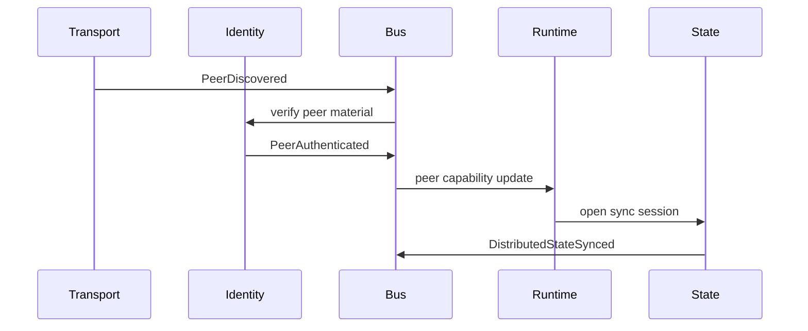

# Distributed Event Bus

Status: draft  
Scope: typed event architecture for VOIDNET components

VOIDNET is event-driven internally and protocol-driven externally. The distributed event bus is the discipline that keeps those concerns explicit. It is not a global broker. It is a typed event fabric spanning local components and selected distributed propagation.

## Event Boundaries

Events are emitted at layer boundaries:

- Transport emits peer and stream events.
- Identity emits trust and revocation events.
- DNS emits resolution and conflict events.
- Runtime emits app lifecycle and permission events.
- State emits synchronization and merge events.

Application payloads do not become system events unless a protocol layer promotes them.

## Initial Event Vocabulary

```text
PeerDiscovered {
  peer_id,
  addresses,
  source
}

PeerAuthenticated {
  peer_id,
  identity_key,
  capabilities
}

PeerDisconnected {
  peer_id,
  reason
}

DomainResolved {
  domain,
  target,
  record_sequence
}

RuntimeMounted {
  app_id,
  uri,
  isolation_id
}

RuntimeIsolated {
  app_id,
  isolation_id,
  boundary
}

SessionEncrypted {
  peer_id,
  session_id,
  cipher
}

MeshPartitionDetected {
  neighborhood,
  evidence
}

IdentityRevoked {
  peer_id,
  issuer,
  sequence
}

DistributedStateSynced {
  namespace,
  peer_id,
  snapshot_sequence
}
```

## Async Event Flow



## Propagation

Events are classified before propagation:

- Local-only: runtime mount, local permission denial, storage flush.
- Neighborhood: peer authenticated, peer disconnected, route degraded.
- Authority-scoped: domain resolved, state synced, app lifecycle.
- Network-critical: identity revoked, namespace conflict, partition detected.

No event class should imply unbounded flooding.

## Observability

Events should be traceable across:

- `event_id`.
- `causation_id`.
- `correlation_id`.
- `issuer_peer_id`.
- `observed_at`.
- `layer`.

This supports debug traces, replay-safe auditing, partition diagnosis, and runtime permission inspection.

## Tracing Potential

Future tracing can reconstruct:

- How a `.void` name resolved.
- Which peer introduced a route.
- Which identity signed a state snapshot.
- Why a runtime grant was accepted or rejected.
- When a mesh partition began and healed.

