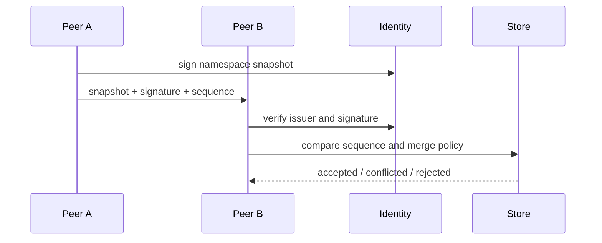

# Distributed State Layer

Status: draft  
Scope: future replicated persistence architecture

VOIDNET requires distributed state for rooms, app manifests, namespace records, runtime metadata, and application data that must survive peer churn. This layer is not blockchain. It does not require global consensus, token mechanics, mining, or a single universal ledger.

The target is scoped replicated state with signatures, partial synchronization, deterministic recovery, and conflict-aware merges.

## Principles

- State is scoped by namespace and authority.
- Synchronization is partial by default.
- Snapshots and deltas are signed.
- Conflicts are explicit data.
- Recovery must be deterministic.
- Offline operation is normal.

## State Objects

```text
StateObject {
  namespace,
  key,
  value_hash,
  sequence,
  issuer,
  signature,
  previous,
  merge_policy
}
```

## Replicated State

Peers replicate only the namespaces they are authorized to observe or maintain. A chat room, DNS namespace, runtime app cache, and identity revocation list may each use different replication policies.

## Partial Synchronization

Partial synchronization allows a peer to request:

- Latest snapshot for a namespace.
- Delta range after a known sequence.
- Conflict set for a key.
- Revocation updates.
- Missing content by hash.

## Signed State Snapshots



Snapshots must include issuer identity, namespace, sequence, previous hash, and signature. Snapshot acceptance is a state transition, not blind replacement.

## Deterministic Recovery

Recovery should be deterministic given:

- Trusted root identity set.
- Accepted revocation records.
- Last stable snapshot.
- Ordered deltas.
- Merge policy.

This allows nodes to rebuild local state after disk loss, partition recovery, or app remount.

## Conflict-Aware Merges

Conflict behavior is policy-specific:

- Last valid sequence for single-writer records.
- Multi-value retention for disputed DNS names.
- CRDT-like merge for collaborative app state.
- Manual adjudication for high-authority namespace collisions.

Conflict evidence must be retained. Distributed disagreement is operational data.

## Distributed Memory Concepts

The state layer can become a distributed memory substrate for runtime surfaces:

- Local namespace cache.
- Peer-provided memory segments.
- Signed app state checkpoints.
- Capability-scoped reads and writes.
- Recovery from multiple partial peers.

This must remain bounded by authority, identity, and merge policy.

