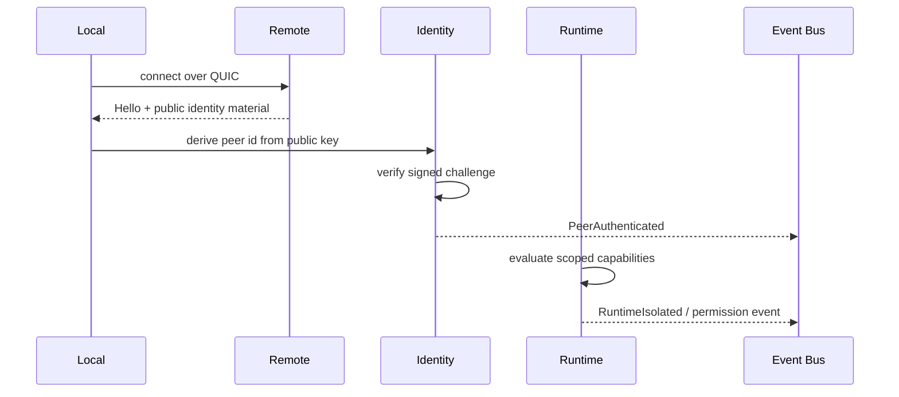
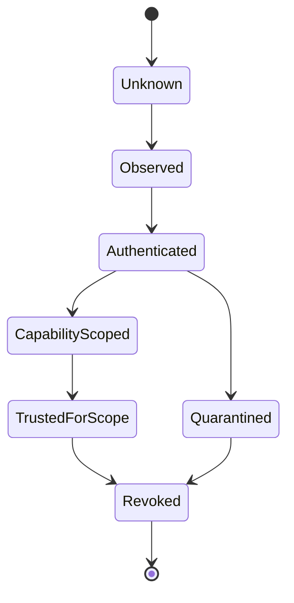

# VOID Identity

Status: draft  
Scope: deterministic peer identity and signed messages

VOIDNET does not use email and password accounts. A node identity is a public/private keypair. The public key deterministically derives the peer identifier.

## Requirements

- ed25519 public/private keypair.
- Deterministic peer id from the public key.
- Signed messages.
- Identity persistence on disk.
- Future x25519 session keys for encrypted payload exchange.

## Identity Shape

```text
NodeIdentity {
  signing_key: ed25519 secret key
  verifying_key: ed25519 public key
  peer_id: blake3(public_key)
}
```

The current peer id string format is:

```text
vpid1<blake3-public-key-hex>
```

This format is intentionally marked v1. A later migration may align it with multibase or libp2p peer id encoding.

## Signed Payload

```text
SignedPayload {
  peer_id,
  public_key,
  payload,
  signature
}
```

Verification checks:

1. Public key decodes correctly.
2. `peer_id` matches the deterministic public key hash.
3. The ed25519 signature verifies over `payload`.

## Persistence

The node stores identity material as JSON during Phase 1:

```text
.voidnet/node/identity.json
```

The file contains peer id, public key, and secret key encoded with base64 without padding. This is a development format. Production storage must add OS keychain support or encrypted-at-rest storage.

## Message Security

Identity signatures prove authorship. They do not encrypt payloads. Private messaging should use:

- ed25519 for identity signatures.
- x25519 for key agreement.
- AES-GCM for encrypted message bodies.

## Rotation

Identity rotation is not silent. A rotated identity is a new peer unless there is a signed migration statement from the previous key.

## Identity Philosophy

Identity is infrastructure. It is the root of peer existence, message authorship, DNS authority, runtime permission anchoring, state snapshot verification, and trust propagation. VOIDNET identity does not represent an account, a profile, or an email-bound user. It represents a cryptographic participant in the network.

The identity layer must answer five questions:

1. Who produced this protocol artifact?
2. Does the claimed peer id match the public key?
3. Is the signature valid for this exact payload?
4. Is the operation fresh within its replay window?
5. Is the peer authorized for this scope?

## Cryptographic Identity Roots

Long-term peer identity is rooted in ed25519 signing keys. The verifying key is public network material. The signing key is local authority and must not leave the node boundary.

Session confidentiality is separate from identity:

- ed25519: long-term signing and authorship.
- x25519: session key agreement.
- AES-GCM: encrypted payload bodies.

This separation allows peers to rotate encrypted sessions without rotating long-term identity.

## Signed Protocol Envelopes

Protocol envelopes should become signed artifacts:

```text
SignedEnvelope {
  envelope,
  signer_peer_id,
  public_key,
  nonce,
  sequence,
  signature
}
```

The signature should cover protocol version, stream id, frame type, payload hash, nonce, sequence, and intended scope. A signature over only the payload is insufficient for routing-sensitive operations.

## Trust Establishment

Trust establishment is a staged process:



Authentication is not authorization. A peer can be authenticated and still forbidden from writing a namespace, mounting an app, or joining a room.

## Capability Negotiation

Capability negotiation should be signed and scoped:

```text
CapabilityStatement {
  peer_id,
  protocol_versions,
  supported_frames,
  state_namespaces,
  app_capabilities,
  expires_at,
  signature
}
```

Capabilities are claims until local policy accepts them. The runtime may expose accepted capabilities as permission prompts or internal grants.

## Distributed Trust Propagation

Trust may propagate through signed evidence:

- Peer authentication observations.
- Revocation records.
- Namespace ownership statements.
- App manifest signatures.
- State snapshot signatures.

Propagation must remain bounded. VOIDNET should never assume that trust becomes global because one peer relayed a statement.

## Runtime Permission Anchoring

Runtime permissions bind application authority to identity:

```text
RuntimePermission {
  app_id,
  subject_peer_id,
  capability,
  scope,
  issued_by,
  sequence,
  signature
}
```

The runtime is responsible for enforcing this boundary. The browser surface may request approval, but it does not own authority.

## Trust Lifecycle



State meanings:

- `Unknown`: no validated identity material.
- `Observed`: peer address or unsigned claim seen.
- `Authenticated`: peer id matches public key and signature challenge.
- `CapabilityScoped`: peer has advertised capabilities that local policy is evaluating.
- `TrustedForScope`: peer is trusted for a specific operation or namespace.
- `Quarantined`: peer produced suspicious material or violated policy.
- `Revoked`: peer or capability is rejected by signed revocation or local policy.

## Peer Revocation

Revocation is a signed state transition, not a delete operation. A revocation record should include subject, issuer, reason code, sequence, optional expiry, and signature. Nodes may apply revocation differently based on namespace policy, but revocation evidence should be retained.

## Rotating Session Keys

Session keys should rotate:

- At connection establishment.
- After configured byte or time thresholds.
- After suspicious replay attempts.
- After partition healing when stale sessions may exist.

Long-term identity signs the negotiation. x25519-derived secrets protect payload confidentiality.

## Replay Protection Concepts

Replay defense should combine:

- Nonces.
- Monotonic sequence windows.
- Session identifiers.
- Stream identifiers.
- Timestamp tolerance where clocks are trustworthy enough.
- Rejection caches for recent signed operations.

Replay rejection should emit observability events. Silent drops hide attacks and complicate debugging.
