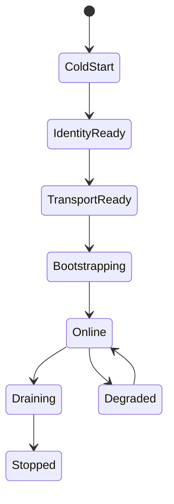
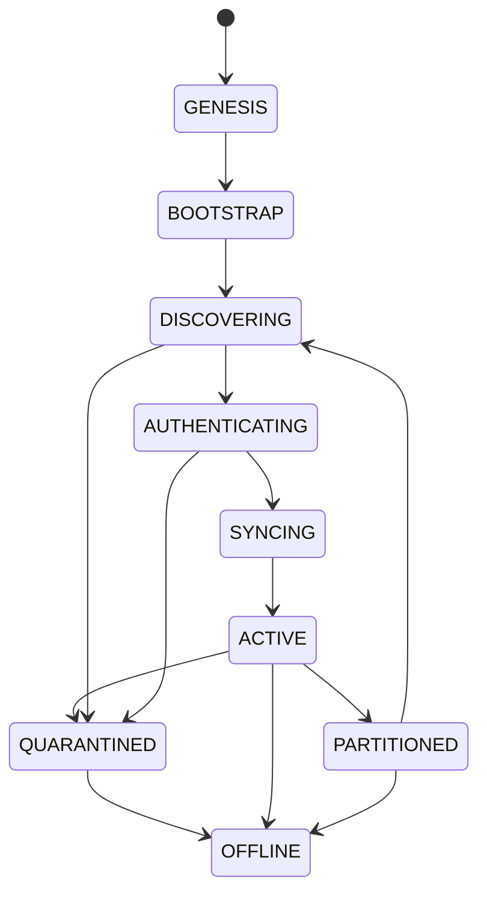

# VOIDNode Lifecycle

Status: draft  
Scope: lifecycle of a Phase 1 peer node

## States



## Cold Start

The node loads configuration and finds its data directory.

Inputs:

- Data directory.
- Listen address.
- Bootstrap addresses.
- Runtime configuration.

## Identity Ready

The node loads or creates its ed25519 identity:

```text
.voidnet/node/identity.json
```

The peer id is derived from the public key. No network service starts before identity is ready.

## Transport Ready

The node builds the libp2p/QUIC transport and starts listening on configured multiaddrs.

Phase 1 default:

```text
/ip4/0.0.0.0/udp/0/quic-v1
```

## Bootstrapping

The node dials configured bootstrap peers, exchanges `Hello` frames, and discovers peers and `.void` records.

## Online

The node processes:

- Transport events.
- Runtime commands.
- DNS lookups.
- App envelopes.
- Storage events.

All application traffic should pass through VOID Protocol envelopes.

## Degraded

The node enters degraded mode when transport is partially available, bootstrap peers are unreachable, or local storage needs repair. Degraded nodes may continue serving cached records and local apps.

## Draining

On shutdown the node stops accepting new streams, flushes storage, announces disconnect where possible, and closes the transport.

## Protocol Lifecycle States

The implementation boot names above describe the current Phase 1 shell. The protocol lifecycle uses stricter network states:

```text
GENESIS
BOOTSTRAP
DISCOVERING
AUTHENTICATING
SYNCING
ACTIVE
PARTITIONED
QUARANTINED
OFFLINE
```



## GENESIS

The node has started but has not joined the mesh. It loads configuration, opens local storage, and loads or creates identity material.

Failure scenarios:

- Identity file corrupted.
- Storage unavailable.
- Invalid listen address.

Recovery paths:

- Repair or recreate local identity only through explicit operator action.
- Start in local-only mode if transport cannot bind.

## BOOTSTRAP

The node attempts initial reachability through configured bootstrap addresses. Bootstrap establishes network contact, not trust.

Failure scenarios:

- Bootstrap peers unavailable.
- Fake bootstrap node responds with false topology.
- QUIC dial fails repeatedly.

Recovery paths:

- Exponential backoff.
- Try alternate bootstrap peers.
- Continue with cached peers when available.

## DISCOVERING

The node expands its peer view through identify, ping, routing hints, DHT queries, and cached peer records.

Failure scenarios:

- Peer churn.
- Stale addresses.
- Excessive discovery noise.

Recovery paths:

- Prune failed addresses.
- Rate-limit discovery.
- Preserve last known good peer neighborhoods.

## AUTHENTICATING

The node verifies peer identity material, signed challenges, protocol version support, and capability claims.

Failure scenarios:

- Invalid signatures.
- Peer id and public key mismatch.
- Replay of stale authentication material.
- Unsupported protocol version.

Recovery paths:

- Reject the session.
- Emit authentication failure events.
- Quarantine repeat offenders.

## SYNCING

The node synchronizes required state: DNS cache entries, revocation records, app manifests, room metadata, and selected state namespaces.

Failure scenarios:

- Conflicting snapshots.
- Stale sequence numbers.
- Partitioned state views.

Recovery paths:

- Retain conflict evidence.
- Request snapshots from alternate peers.
- Apply namespace-specific merge policy.

## ACTIVE

The node participates in the mesh. It routes envelopes, resolves names, serves runtime requests, processes app traffic, and syncs state under policy.

Failure scenarios:

- Peer neighborhood degradation.
- Hostile traffic.
- Runtime isolation violation.

Recovery paths:

- Reduce propagation.
- Re-score peers.
- Revoke or suspend capabilities.

## PARTITIONED

The node detects loss of mesh visibility or conflicting evidence that suggests network partition.

Failure scenarios:

- Local network outage.
- Targeted isolation.
- Bootstrap capture.
- Divergent state snapshots.

Recovery paths:

- Operate from cached state with TTL boundaries.
- Probe alternate paths.
- Mark state as partition-suspect.
- Heal by comparing signed snapshots after reconnection.

## QUARANTINED

The node or a peer is placed into a restricted state because trust checks failed or hostile behavior was observed.

Failure scenarios:

- Repeated invalid signatures.
- Flood behavior.
- Namespace poisoning.
- Identity spoofing.

Recovery paths:

- Drop nonessential frames.
- Preserve evidence.
- Require fresh authentication.
- Await revocation or operator policy.

## OFFLINE

The node has stopped participating in the mesh. Storage should be flushed, runtime mounts suspended, and transport closed.

## Mesh Healing

Mesh healing is the transition from `PARTITIONED` to `DISCOVERING`, `AUTHENTICATING`, `SYNCING`, and back to `ACTIVE`.

Healing requires:

- Fresh peer discovery.
- Re-authentication.
- Revocation update check.
- Signed state comparison.
- Conflict-aware merge.
- Emission of recovery events.

Reconnect behavior must avoid stampedes. Nodes should back off, randomize retry intervals, and prioritize trusted peers before broad propagation.
