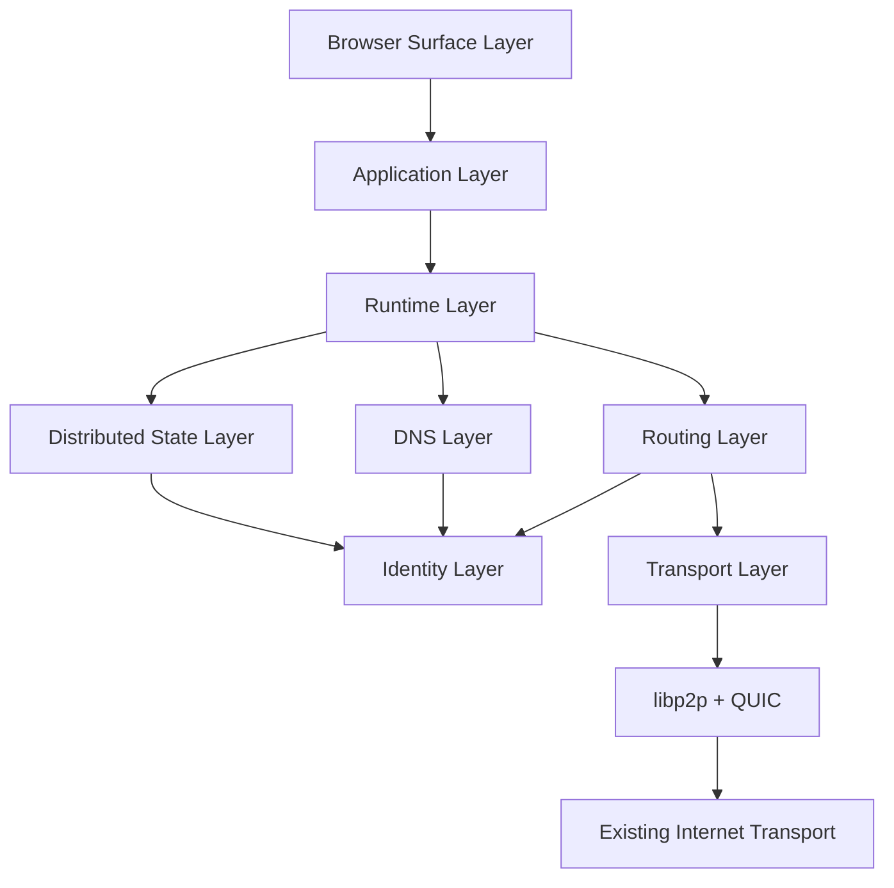
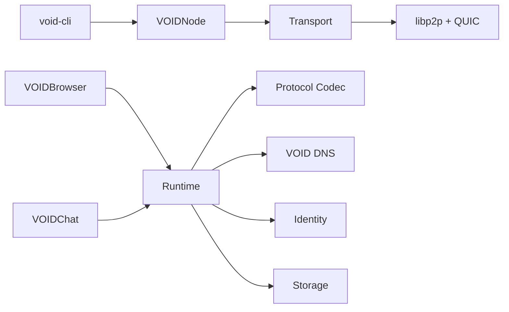
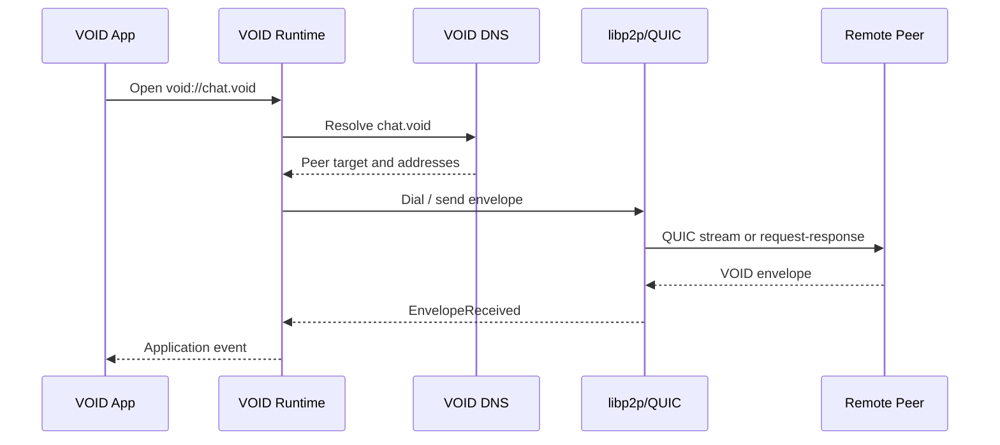

# VOIDNET Architecture Overview

Status: draft  
Scope: system-level shape for Phase 1

VOIDNET runs as a sovereign application layer above existing internet transport. Nodes use libp2p over QUIC for connectivity, VOID Protocol for application frames, VOID DNS for `.void` naming, and ed25519 identities for deterministic peer identity.

The system is a distributed operating substrate. Transport, identity, DNS, runtime, state, applications, and browser surface are separate protocol responsibilities, not modules of a traditional app backend.

Reference philosophy:

- [Architecture Philosophy](philosophy.md)
- [System Layer Model](system-layer-model.md)
- [Transport Philosophy](transport-philosophy.md)
- [Runtime Philosophy](runtime-philosophy.md)
- [Distributed Event Bus](distributed-event-bus.md)
- [Distributed State Layer](distributed-state.md)
- [Threat Model](threat-model.md)
- [Trust Flow](trust-flow.md)

## Layer Model

## Node Components

## Event Flow

## Boundaries

The project avoids a backend-first architecture. The runtime is the composition point:

- Protocol owns URI syntax, frame types, and binary envelope encoding.
- Identity owns key generation, signatures, peer id derivation, and persistence.
- DNS owns `.void` naming, cache semantics, and future DHT-backed lookup.
- Transport owns libp2p/QUIC and emits network events.
- Runtime owns app permissions, routing decisions, and app-facing events.
- Storage owns local persistent namespaces.
- Distributed state owns future replicated state, signed snapshots, partial synchronization, and conflict-aware merges.
- Event bus owns typed state transition visibility across layer boundaries.

## Core Failure Model

VOIDNET treats failure as state:

- Churn becomes transport events.
- Spoof attempts become authentication failures.
- Namespace poisoning becomes conflict evidence.
- Partition becomes `PARTITIONED` state.
- Hostile peers become quarantine candidates.
- Runtime violations become permission and isolation events.

This keeps the system inspectable under hostile or degraded conditions.

## First Milestone

Phase 1 is successful when two nodes can:

1. Create and persist deterministic identities.
2. Discover or bootstrap to each other.
3. Resolve a `.void` name to a peer target.
4. Exchange signed encrypted VOID Protocol messages.
5. Run VOIDChat through the same runtime path the browser will use.
