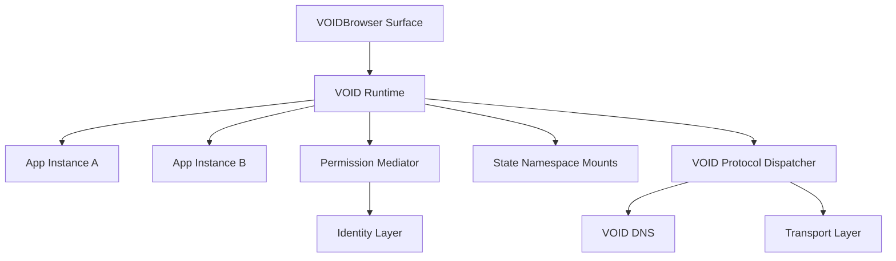
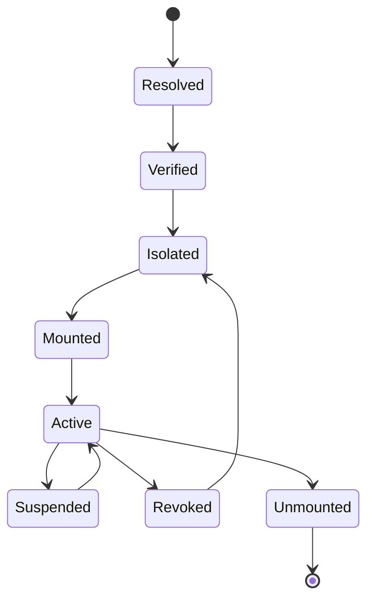

# Runtime Philosophy

Status: draft  
Scope: VOID Runtime as distributed operating layer

The VOID runtime is not a browser runtime. It is the execution and mediation layer for distributed protocol applications. It receives intent from application surfaces, verifies authority, resolves names, mounts state, grants capabilities, and dispatches typed communication through VOID Protocol.

## Runtime Commitments

- Applications are distributed protocol surfaces.
- Execution is capability-based.
- Identity, storage, transport, and streams are mediated.
- App state is isolated unless explicitly shared.
- Permission grants are scoped, observable, and revocable.
- Runtime communication is typed and async.

## Capability-Based Execution

An application does not receive ambient authority. It receives explicit capabilities:

- Network access.
- Identity signing.
- Storage namespace access.
- Stream access to an authority.
- State synchronization for a namespace.
- UI actions bound to `void://` URIs.

Capabilities should be narrow. A grant to sign a room membership statement is not a grant to sign arbitrary envelopes.

## Runtime Isolation

Isolation applies to:

- Memory and state namespaces.
- Identity signing authority.
- Network streams.
- UI action dispatch.
- Runtime events visible to an app.

## Permission Mediation

Runtime permissions are protocol artifacts, not UI preferences. A permission grant should carry:

- Subject app identity.
- Issuer identity.
- Capability type.
- Scope.
- Expiration or revocation condition.
- Audit event.

Permission denial is also an event. Silent denial makes distributed systems harder to inspect.

## Distributed App Execution

A VOID application may be mounted from a `.void` service, a content target, or a peer-provided document. The runtime treats the app as a mounted protocol surface:

1. Resolve authority.
2. Verify app manifest or source identity.
3. Create isolated runtime context.
4. Request capabilities.
5. Mount UI or native surface.
6. Bind streams and state namespaces.
7. Emit lifecycle events.

## Runtime-Native Communication

Applications communicate through:

- `AppCall` frames.
- `StreamOpen`, `StreamData`, and `StreamClose` frames.
- Signed state deltas.
- Runtime events.
- VOID UI actions.

They do not directly open sockets or assume a centralized API endpoint.

## Application Lifecycle

Lifecycle transitions must be observable through the distributed event bus.

