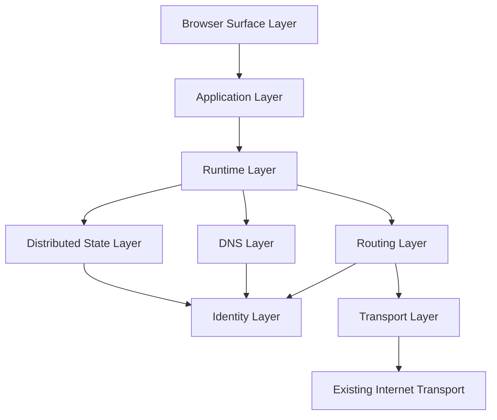

# System Layer Model

Status: draft  
Scope: canonical infrastructure layers for VOIDNET

VOIDNET is a distributed operating layer above existing internet transport. It is not a web application architecture. Each layer owns a protocol boundary, a trust boundary, and a failure boundary.

```text
VOIDNET
|-- Transport Layer
|-- Identity Layer
|-- Routing Layer
|-- DNS Layer
|-- Runtime Layer
|-- Distributed State Layer
|-- Application Layer
`-- Browser Surface Layer
```



## Transport Layer

Responsibilities:

- Maintain encrypted peer connectivity over libp2p and QUIC.
- Handle listen addresses, dialing, peer churn, reconnects, and swarm events.
- Emit transport events without leaking libp2p internals into application logic.

Isolation boundaries:

- Owns sockets, streams, and swarm behavior.
- Does not own identity trust beyond carrying authenticated peer material upward.
- Does not decide application permissions.

Communication model:

- Typed commands into the transport.
- Typed events out of the transport.
- VOID Protocol envelopes over request-response, streams, or pubsub-like propagation.

Trust assumptions:

- Remote peers are untrusted until identity verification completes.
- Addresses are not identity.
- Bootstrap reachability is not bootstrap trust.

Future scalability goals:

- Adaptive peer scoring.
- Backpressure-aware stream scheduling.
- Partition detection.
- Mesh repair after churn and reconnect storms.

## Identity Layer

Responsibilities:

- Create and persist cryptographic peer roots.
- Derive deterministic peer identifiers.
- Sign protocol envelopes, DNS records, state snapshots, and trust transitions.
- Negotiate rotating session keys for encrypted payloads.

Isolation boundaries:

- Owns long-term key material.
- Exposes signing and verification through narrow APIs.
- Runtime permissions must mediate identity signing for applications.

Communication model:

- Signed payloads and signature verification results.
- Trust events emitted into the distributed event bus.
- Capability statements bound to peer identity.

Trust assumptions:

- A valid signature proves key possession, not moral trust.
- Trust is contextual, scoped, and revocable.
- Session keys expire independently from long-term identity roots.

Future scalability goals:

- Key rotation statements.
- Peer revocation records.
- Trust graph propagation.
- Hardware or OS-backed key storage.

## Routing Layer

Responsibilities:

- Select next hops for VOID Protocol envelopes.
- Enforce hop limits and route boundaries.
- Detect partition signals from failed paths and degraded peer neighborhoods.
- Preserve routing metadata for observability.

Isolation boundaries:

- Does not parse application payloads.
- Does not make DNS ownership decisions.
- Does not bypass identity verification.

Communication model:

- Route frames.
- Envelope forwarding events.
- Peer and path state from transport and identity layers.

Trust assumptions:

- Routes can be manipulated by hostile peers.
- Path claims require evidence.
- Forwarded data must be bounded and rate-limited.

Future scalability goals:

- Peer scoring.
- Opportunistic path diversity.
- Partition-aware propagation.
- Route cache invalidation based on observed failures.

## DNS Layer

Responsibilities:

- Resolve `.void` names into peer, content, or service targets.
- Maintain local TTL cache.
- Verify signed records and retain conflict evidence.
- Query distributed lookup backends.

Isolation boundaries:

- Owns name records, not transport sessions.
- Does not trust bootstrap records without verification.
- Does not silently resolve conflicting ownership.

Communication model:

- `DnsRecord` structures.
- `DomainResolved` and namespace conflict events.
- Future DHT lookup and signed record replication.

Trust assumptions:

- Names are contested state.
- Record freshness is bounded by TTL and sequence.
- Record issuers must be checked against trust policy.

Future scalability goals:

- Distributed lookup with signed records.
- Conflict-aware cache.
- Revocation and delegation records.
- Namespace audit traces.

## Runtime Layer

Responsibilities:

- Mount distributed applications.
- Mediate capabilities and permissions.
- Isolate app state and app communication.
- Dispatch `void://` calls through DNS, routing, state, and transport.

Isolation boundaries:

- Owns sandbox policy.
- Does not expose raw identity keys or raw transport streams to applications.
- Browser surface cannot bypass runtime mediation.

Communication model:

- Runtime commands and runtime events.
- Permission requests.
- Application manifests.
- VOID UI documents and app call frames.

Trust assumptions:

- Applications are not trusted by default.
- Permissions are capabilities, not preferences.
- Runtime grants must be scoped, observable, and revocable.

Future scalability goals:

- App sandboxing.
- Capability leases.
- Runtime-level audit logs.
- Distributed app lifecycle orchestration.

## Distributed State Layer

Responsibilities:

- Replicate state across authorized peers.
- Support partial synchronization and deterministic recovery.
- Sign snapshots and deltas.
- Merge conflicts with explicit policy.

Isolation boundaries:

- Does not imply global consensus.
- Does not define monetary incentives.
- Does not replace application-level authorization.

Communication model:

- Signed snapshots.
- State deltas.
- Sync sessions.
- Conflict events.

Trust assumptions:

- Peers can lie about state.
- Snapshots require issuer identity and sequence validation.
- Merges must preserve evidence of disagreement.

Future scalability goals:

- Namespace-scoped replication.
- Offline-first reconciliation.
- Conflict-aware state stores.
- Verifiable app state recovery.

## Application Layer

Responsibilities:

- Define protocol-native app behavior.
- Consume runtime capabilities.
- Emit and receive VOID Protocol frames.
- Maintain app-specific state under runtime policy.

Isolation boundaries:

- Applications do not own network sockets.
- Applications do not own long-term identity material.
- Applications cannot bypass DNS or permission mediation.

Communication model:

- App calls.
- Stream frames.
- VOID UI documents.
- Runtime-mounted state and permissions.

Trust assumptions:

- App authorship and app execution are separate trust questions.
- App manifests are declarations, not proof of safety.
- App communication must be typed and bounded.

Future scalability goals:

- App manifests signed by identities.
- Distributed app package resolution.
- Permission templates.
- Runtime-portable app surfaces.

## Browser Surface Layer

Responsibilities:

- Present VOID runtime surfaces to the user.
- Navigate `void://` authorities.
- Render VOID UI documents.
- Display permission prompts and isolation status.

Isolation boundaries:

- Does not execute unmediated scripts.
- Does not own protocol routing.
- Does not own app storage.

Communication model:

- Runtime commands.
- Rendered VOID UI AST.
- Permission grant and revoke operations.

Trust assumptions:

- Display is not authority.
- User intent must be translated into runtime capabilities.
- Browser state must not leak between isolated app surfaces.

Future scalability goals:

- Native Tauri shell.
- App isolation visualization.
- Runtime session recovery.
- Permission audit surface.
