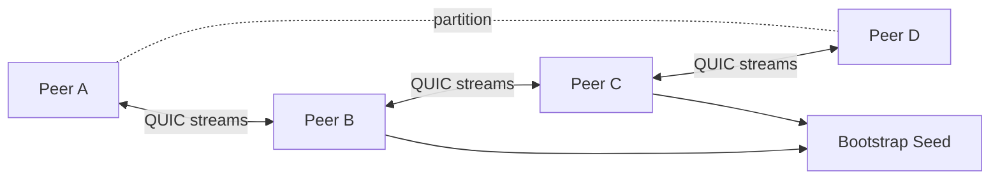
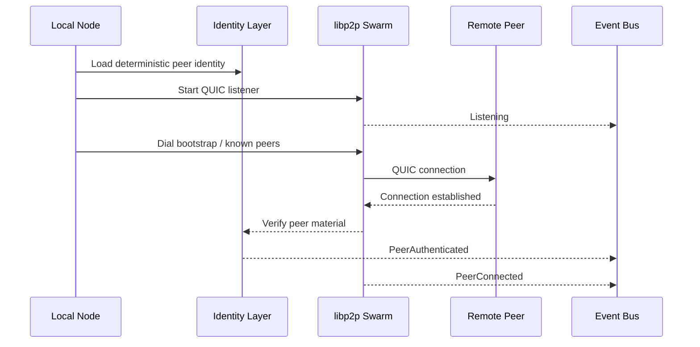

# Transport Philosophy

Status: draft  
Scope: VOIDNET transport behavior and resilience assumptions

VOIDNET transport is not client/server networking. Nodes are sovereign participants in a distributed encrypted mesh. A node is not a client waiting for a server to accept it. A node is an autonomous actor with identity, state, routing memory, and recovery behavior.

## Transport Commitments

- Use libp2p for peer-to-peer networking primitives.
- Use QUIC for encrypted, multiplexed transport.
- Keep networking async and event-driven.
- Emit typed network events across the system boundary.
- Treat topology as unstable by default.

## Mesh Conditions

The transport layer must survive:

- Peer churn.
- Unstable networks.
- Reconnect storms.
- Partial partitions.
- Hostile peers.
- Spoof attempts.
- Unreliable latency.
- Bootstrap unavailability.

These are not exceptional conditions. They are normal operating conditions for a sovereign distributed network.

## Autonomous Peer Existence

A VOID node must be able to:

- Start without a central authority.
- Persist its identity locally.
- Listen on configured multiaddrs.
- Dial bootstrap peers when available.
- Continue operating with cached state during partition.
- Rejoin and heal after disconnection.

Transport reachability is temporary. Identity continuity is persistent.

## Encrypted Mesh Topology

The mesh is not assumed to be complete. Nodes may maintain partial views of the network. The transport layer should expose enough events for routing and DNS layers to detect path degradation without requiring global topology knowledge.

## Event-Driven Networking

Transport emits events such as:

- Peer discovered.
- Peer connected.
- Peer authenticated.
- Peer disconnected.
- Dial failed.
- Stream opened.
- Envelope received.
- Partition suspected.

Consumers do not poll raw swarm state. They subscribe to typed state changes and react with bounded work.

## Swarm Resilience

Swarm resilience requires:

- Backoff for repeated failed dials.
- Rate limits for inbound frames.
- Peer scoring for hostile or noisy participants.
- Stream timeouts.
- Bounded queues.
- Quarantine for suspicious behavior.
- Recovery paths after partition.

## Distributed Propagation

Propagation is constrained. VOIDNET should not flood by default. Messages carry hop limits, route context, and type-specific propagation rules. A content request, DNS record, chat room message, and revocation notice do not share the same propagation semantics.

## Transport Flow

## Failure Posture

The correct response to network failure is not panic. The correct response is state transition:

- Repeated dial failure moves a peer toward degraded reachability.
- Conflicting identity material moves a peer toward quarantine.
- Lost neighborhood connectivity emits partition suspicion.
- Recovered routes emit mesh healing signals.

