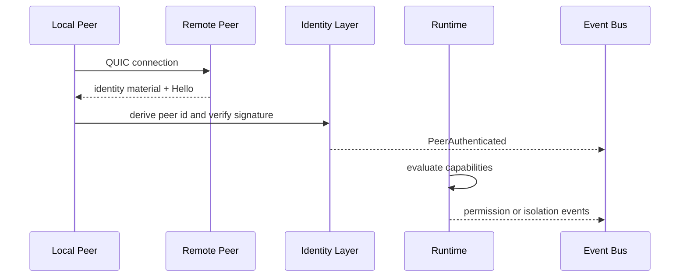
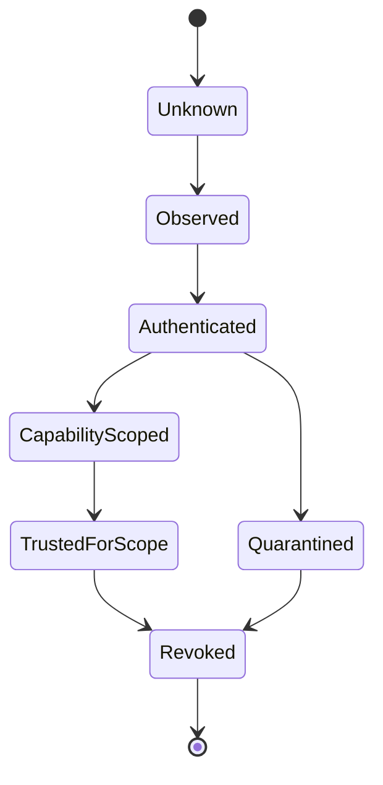

# Trust Flow

Status: draft  
Scope: identity, capability, and trust propagation

VOIDNET trust is not global. Trust is scoped, signed, propagated with evidence, and revoked explicitly. A valid peer identity proves key possession. It does not prove authorization for every namespace, route, app, or state object.

## Trust Establishment



## Trust Lifecycle



## Capability Negotiation

Peers may advertise capabilities, but advertised capability is not authorization. A node verifies:

- Peer identity.
- Signature freshness.
- Supported protocol version.
- Requested capability scope.
- Local trust policy.
- Revocation status.

## Runtime Permission Anchoring

Runtime permissions must anchor to identity:

```text
PermissionGrant {
  app_id,
  issuer_peer_id,
  subject_identity,
  capability,
  scope,
  expires_at,
  signature
}
```

The browser surface displays intent. The runtime enforces authority.

## Revocation

Revocation records should be signed and sequenced:

```text
Revocation {
  subject_peer_id,
  issuer_peer_id,
  reason_code,
  sequence,
  expires_at,
  signature
}
```

Revocation propagation is network-critical but still bounded. Nodes retain revocation evidence and apply it according to namespace policy.

## Replay Protection

Replay defense requires:

- Envelope nonces.
- Sequence windows.
- Session identifiers.
- Timestamp or monotonic counters where available.
- Rejection of duplicate signed operations inside a window.

Replay protection belongs in protocol and identity layers, with runtime-visible audit events for rejected operations.

