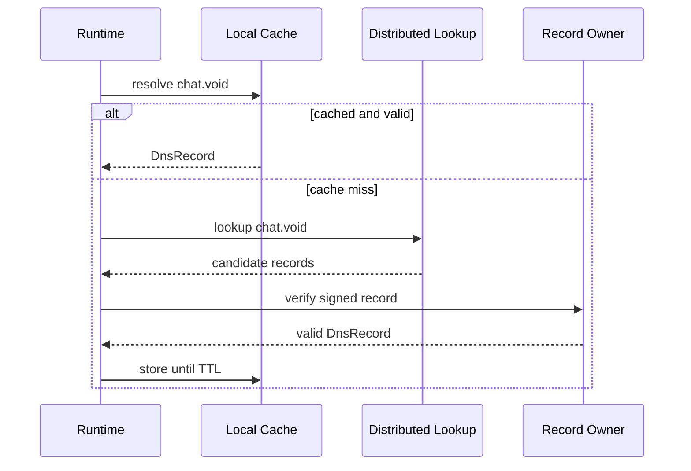

# VOID DNS

Status: draft  
Scope: decentralized name resolution for `.void`

VOID DNS resolves human-scale `.void` names to peer, content, or service targets inside VOIDNET.

Examples:

```text
chat.void
market.void
core.void
```

## Goals

- Resolve `.void` domains without centralized DNS.
- Cache records locally with TTLs.
- Support peer, content, and service targets.
- Allow records to be signed by identity keys.
- Use distributed lookup in Phase 1 after bootstrap.

## Record Model

```text
DnsRecord {
  domain,
  target,
  ttl_secs,
  sequence,
  signed_by
}
```

Targets:

```text
Peer {
  peer_id,
  addresses
}

Content {
  content_id
}

Service {
  uri
}
```

## Resolution Flow



## Cache Behavior

The local cache is advisory. Expired records must not be returned. Negative caching should be short-lived and only added after the distributed lookup design is stable.

## Ownership

Initial ownership should be identity-based:

- A domain record is signed by a VOID identity.
- The highest valid sequence number wins.
- Conflicts are retained for diagnostics rather than silently overwritten.

This is not a global name economy. Phase 1 should prefer explicit bootstrap and trusted seeds over pretending the hard naming problem is solved.

## Bootstrap

Bootstrap nodes may publish seed records such as:

```text
core.void -> Peer { peer_id, addresses }
chat.void -> Service { uri: void://core.void/apps/chat }
```

## Open Questions

- How are first claims for public names adjudicated?
- Should personal names be peer-id scoped by default?
- What is the final DHT record key format?
- How are revocations and key rotations represented?

